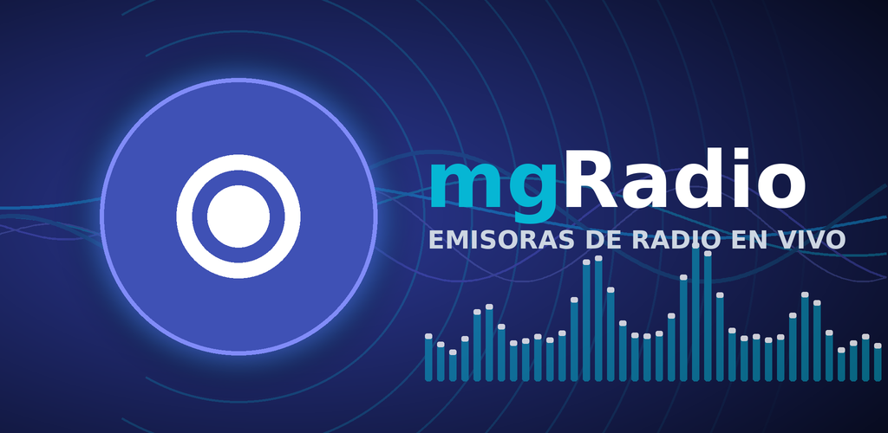
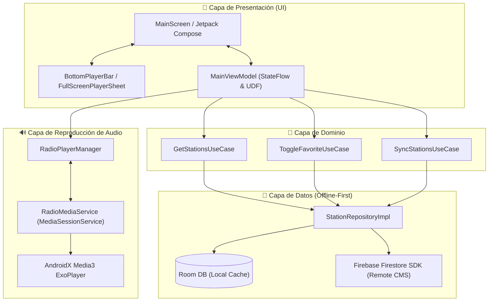

# 📻 mgRadio — Emisoras en Vivo para Android

<p align="center">
  
</p>

<p align="center">
  <strong>Aplicación nativa de streaming de radio en vivo para Android con arquitectura Offline-First, diseño moderno en Jetpack Compose y motor de audio en segundo plano impulsado por AndroidX Media3 (ExoPlayer).</strong>
</p>

<p align="center">
  <a href="#-tecnologías-y-stack"></a>
  <a href="#-tecnologías-y-stack"></a>
  <a href="#-tecnologías-y-stack"></a>
  <a href="#-tecnologías-y-stack"></a>
  <a href="#-tecnologías-y-stack"></a>
  <a href="#-tecnologías-y-stack"></a>
  <a href="#-requisitos-y-entorno"></a>
  <a href="#-requisitos-y-entorno"></a>
  <a href="LICENSE"></a>
</p>

<p align="center">
  
</p>

---

## 📖 Tabla de Contenidos

1. [Visión General](#-visión-general)
2. [Características Principales](#-características-principales)
3. [Arquitectura del Proyecto](#-arquitectura-del-proyecto)
4. [Estructura del Código](#-estructura-del-código)
5. [Tecnologías y Stack](#-tecnologías-y-stack)
6. [Configuración y Puesta en Marcha](#-configuración-y-puesta-en-marcha)
7. [Compilación y Builds](#-compilación-y-builds)
8. [Ecosistema y Backend](#-ecosistema-y-backend)
9. [Privacidad y Políticas](#-privacidad-y-políticas)
10. [Licencia](#-licencia)

---

## 🌟 Visión General

**mgRadio** es una aplicación nativa para Android diseñada para ofrecer una experiencia de audio en streaming fluida, estable y visualmente atractiva. 

El proyecto implementa un enfoque **Offline-First**: la aplicación inicia de inmediato consumiendo la base de datos local en **Room**, mientras sincroniza en segundo plano el catálogo actualizado de emisoras desde **Firebase Firestore**. El reproductor de audio utiliza **AndroidX Media3 (ExoPlayer)** integrado con un `MediaSessionService` para permitir reproducción continua en segundo plano, control por notificación multimedia y compatibilidad con pantallas de bloqueo y dispositivos Bluetooth.

> [!NOTE]
> **Diseño Multipaís & Multiciudad:** Aunque el catálogo inicial está enfocado en las estaciones de la **Ciudad de México (CDMX)** y **Colombia**, la arquitectura de datos, los selectores de la interfaz de usuario y el backend están preparados para escalar a múltiples regiones y países sin requerir modificaciones estructurales.

---

## ✨ Características Principales

- 📻 **Streaming Universal de Alta Calidad:** Soporte para transmisiones en vivo mediante protocolos **Icecast**, **Shoutcast** y **HLS (`.m3u8`)** en formatos **AAC, AAC+ y MP3**.
- 🎵 **Reproducción en Segundo Plano:** Servicio en primer plano (`RadioMediaService`) con `MediaSessionService`, gestión de *Audio Focus*, pausa automática ante llamadas entrantes y reconexión resiliente ante caídas de red.
- 🎛️ **Controles del Sistema:** Notificación enriquecida de controles multimedia, soporte para Android Auto / Bluetooth y pantalla de bloqueo.
- 🌍 **Filtros Dinámicos por País y Ciudad:** Selector desplegable interactivo para explorar emisoras organizadas geográficamente (e.g. México / CDMX, Colombia / Bogotá).
- 🔍 **Buscador Rápido en Tiempo Real:** Búsqueda instantánea por nombre de emisora, frecuencia (FM/AM) o género musical.
- ⭐ **Sistema de Favoritos:** Marcado rápido de emisoras favoritas con persistencia en base de datos local y pestaña dedicada.
- 📱 **Mini Reproductor y Reproductor Completo:**
  - *Bottom Player Bar* accesible desde cualquier sección.
  - *Full Screen Player Sheet* con portada en alta resolución, indicador visual de buffer/reproducción, controles de volumen e información detallada de la transmisión.
- ⚡ **Modo Offline-First:** Arranque ultrarrápido sin pantalla de bloqueo por carga de red.
- 🌙 **Diseño Moderno Material 3:** Interfaz oscura (Dark Theme) optimizada para paneles AMOLED, con paleta de colores personalizada (*Primary Cyan & Dark Surface*) y animaciones fluidas.

---

## 🏗️ Arquitectura del Proyecto

El proyecto sigue las directrices de **Clean Architecture** y el patrón de diseño **MVVM (Model-View-ViewModel)** con **Unidirectional Data Flow (UDF)**:



---

## 📁 Estructura del Código

```text
app/src/main/java/com/mgradio/app/
├── RadioApplication.kt              # Inicialización de Hilt y Application context
├── MainActivity.kt                  # Activity principal con Surface & Theme de Compose
├── data/
│   ├── local/                       # Room Database, Entity (StationEntity), DAOs
│   ├── mapper/                      # Mapeo bidireccional entre DTOs, Entidades y Modelos de Dominio
│   ├── remote/                      # Cliente y DataSources de Firebase Firestore
│   └── repository/                  # Implementación del repositorio de estaciones (Offline-First)
├── di/                              # Módulos de inyección de dependencias con Hilt (Database, Audio, etc.)
├── domain/
│   ├── model/                       # Modelos de dominio puros (Station, Country, City)
│   ├── repository/                  # Interfaces de repositorio
│   └── util/                        # Utilidades y extensiones de datos
├── media/
│   ├── RadioMediaService.kt         # MediaSessionService de Media3 en primer plano
│   └── RadioPlayerManager.kt        # Controlador y observador del estado de reproducción
└── presentation/
    ├── components/                  # Componentes reutilizables de UI (Player, Cards, Dropdowns, Search)
    ├── main/                        # Pantalla principal, UiState y ViewModel
    └── theme/                       # Configuración de tema Material 3, colores y tipografía
```

---

## 🛠️ Tecnologías y Stack

| Categoría | Tecnología / Librería | Versión / Detalle |
| :--- | :--- | :--- |
| **Lenguaje** | [Kotlin](https://kotlinlang.org/) | `2.0+` |
| **UI Framework** | [Jetpack Compose](https://developer.android.com/jetpack/compose) | Material Design 3 (BOM) |
| **Inyección de Dependencias** | [Hilt (Dagger-Hilt)](https://dagger.dev/hilt/) | KSP Compiler |
| **Base de Datos Local** | [AndroidX Room](https://developer.android.com/training/data-storage/room) | Room KTX + Coroutines |
| **Motor de Audio** | [AndroidX Media3](https://developer.android.com/guide/topics/media/media3) | ExoPlayer, HLS & Session |
| **Backend & Cloud CMS** | [Firebase Firestore](https://firebase.google.com/docs/firestore) | Firebase Android BoM |
| **Carga de Imágenes** | [Coil Compose](https://coil-kt.github.io/coil/) | Carga asíncrona de logos con caché |
| **Concurrencia** | [Kotlin Coroutines & Flow](https://kotlinlang.org/docs/coroutines-overview.html) | StateFlow / SharedFlow |
| **Plataforma SDK** | Android SDK | Min: **26** (8.0 Oreo) / Target: **36** (16) |

---

## 🚀 Configuración y Puesta en Marcha

### 1. Prerrequisitos

- **Android Studio** (Koala / Ladybug o superior)
- **JDK 17** configurado en el entorno
- Dispositivo físico o emulador con **Android 8.0 (API 26)** o superior

### 2. Clonar el repositorio

```bash
git clone https://github.com/lmsalazae/mgradio-android.git
cd mgradio-android
```

### 3. Configuración de Firebase

1. Crea un proyecto en [Firebase Console](https://console.firebase.google.com/).
2. Añade una aplicación Android con el Package Name `com.mgradio.app`.
3. Descarga el archivo `google-services.json` y colócalo en el directorio del módulo:
   ```text
   radio-android/app/google-services.json
   ```
4. Habilita **Cloud Firestore** en tu proyecto de Firebase. Las reglas recomendadas de lectura pública y escritura protegida son:
   ```javascript
   rules_version = '2';
   service cloud.firestore {
     match /databases/{database}/documents {
       match /stations/{stationId} {
         allow read: if true;
         allow write: if false; // Solo administradores mediante CLI / Service Account
       }
     }
   }
   ```

---

## 📦 Compilación y Builds

### Ejecutar en modo Debug

Para compilar e instalar directamente en un dispositivo o emulador conectado:

```bash
./gradlew installDebug
```

### Ejecutar pruebas unitarias

```bash
./gradlew test
```

### Generar APK o Android App Bundle (AAB) para Producción

El proyecto incluye configuración de firmado y optimización con **R8**:

```bash
# Generar APK de Release
./gradlew assembleRelease

# Generar App Bundle (.aab) para Google Play Store
./gradlew bundleRelease
```

Los artefactos generados se ubicarán en `app/build/outputs/` o en la carpeta `app/release/`.

---

## 🌐 Ecosistema y Backend

Para el mantenimiento, descubrimiento y sincronización del catálogo de emisoras en **Cloud Firestore**, el ecosistema cuenta con una herramienta CLI desarrollada en Python:

- **Descubrimiento y Scraping:** Extrae emisoras públicas y abiertas desde directorios comunitarios como *Radio-Browser API*.
- **Verificación de Streams:** Ejecuta *health-checks* HTTP `HEAD/GET` para validar que las URLs de audio transmitan con código de respuesta `200 OK`.
- **Sincronización:** Ejecuta operaciones de *UPSERT* en Firebase Firestore categorizando por país y ciudad.

Consulta la documentación técnica en la carpeta [`docs/`](docs/) para mayores detalles de arquitectura y despliegue:
- [Especificaciones Generales](especificaciones-generales.md)
- [Arquitectura del Sistema](docs/arquitectura.md)
- [Plan de Desarrollo](docs/plan-desarrollo.md)
- [Ficha de Google Play Store](docs/store-listing.md)

---

## 🔒 Privacidad y Políticas

**mgRadio** respeta la privacidad de los usuarios:
- No recopila datos personales identificables ni información de ubicación precisa.
- La reproducción de audio se realiza directamente desde las fuentes públicas de transmisión de cada radiodifusora.
- Puedes consultar la política de privacidad completa en [docs/privacy-policy.md](docs/privacy-policy.md) o en formato web en [docs/privacy-policy.html](docs/privacy-policy.html).

---

## 📄 Licencia

Este proyecto está licenciado bajo la **GNU General Public License v3.0 (GPLv3)**.

Esto significa que:
- Eres libre de usar, estudiar, modificar y distribuir este software.
- Cualquier trabajo derivado o aplicación modificada que se distribuya debe ser publicado bajo los mismos términos de código abierto (GPLv3).
- No se proporciona ninguna garantía sobre el software.

Para consultar los términos y condiciones completos, revisa el archivo [LICENSE](LICENSE).

---

### 📬 Contacto y Soporte

Para consultas, reportes o adición de nuevas emisoras al catálogo:

- ✉️ **Contacto de soporte:** migcontacto@gmail.com
- 🌐 **Sitio Web:** [https://lmsalazae.github.io/mgradio-android](https://lmsalazae.github.io/mgradio-android)

---

<p align="center">
  Hecho con ❤️ para los amantes de la radio en vivo.
</p>
