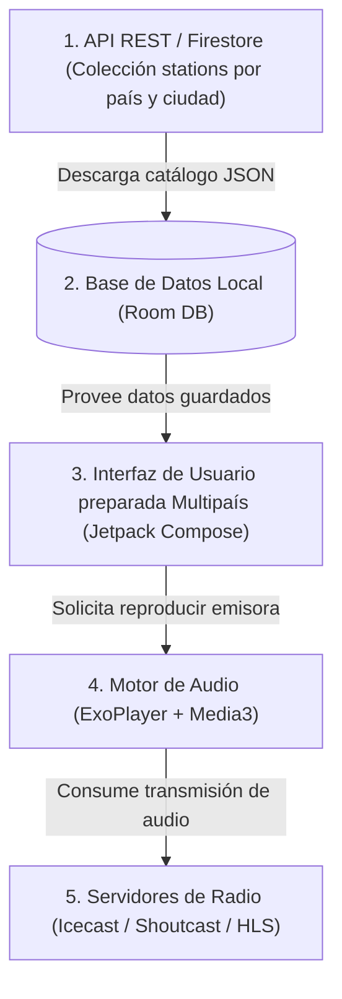
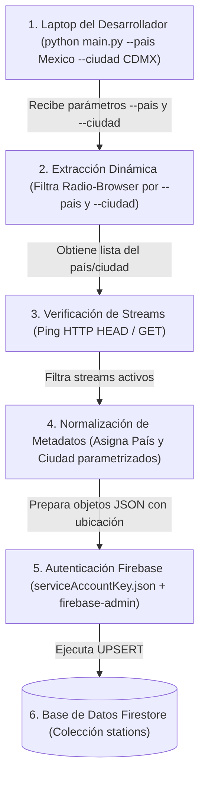
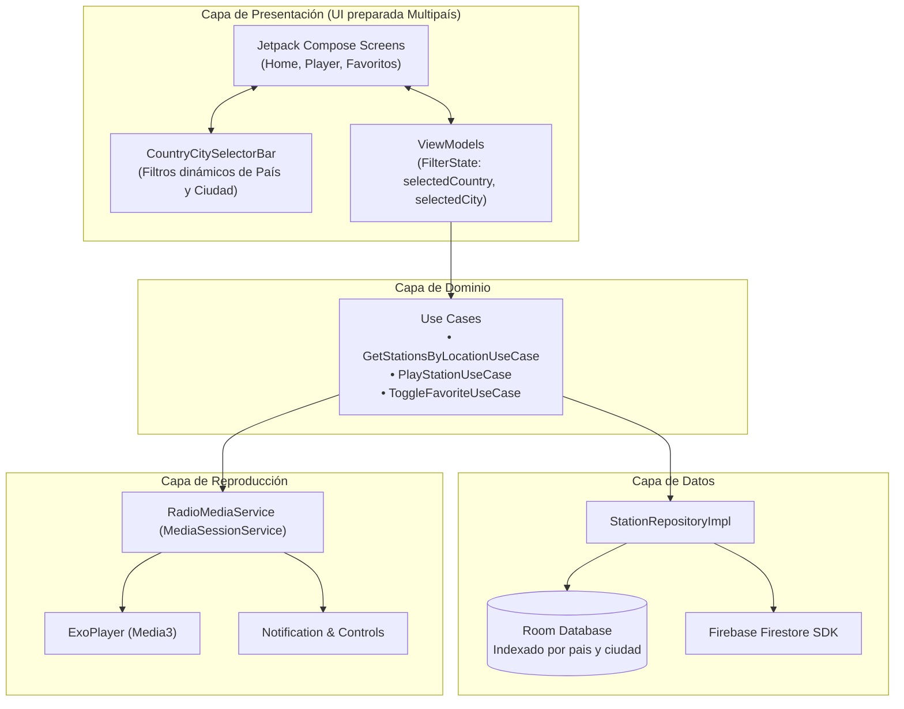
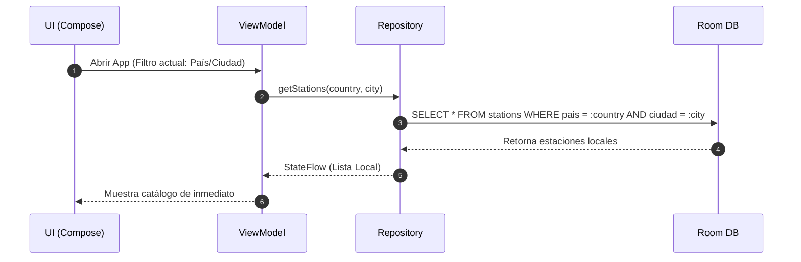
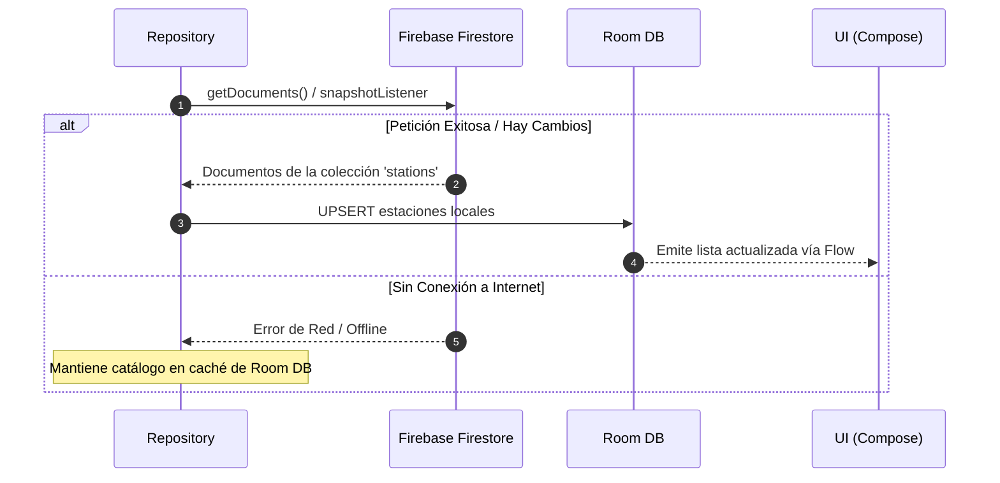
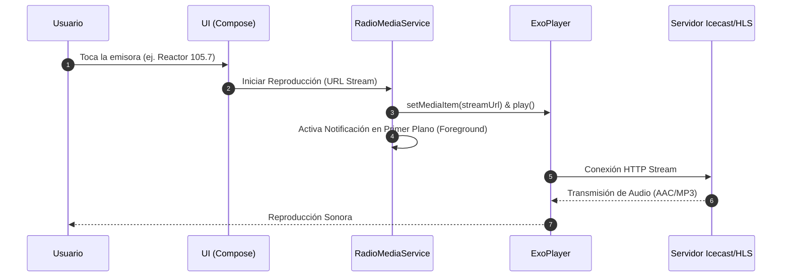
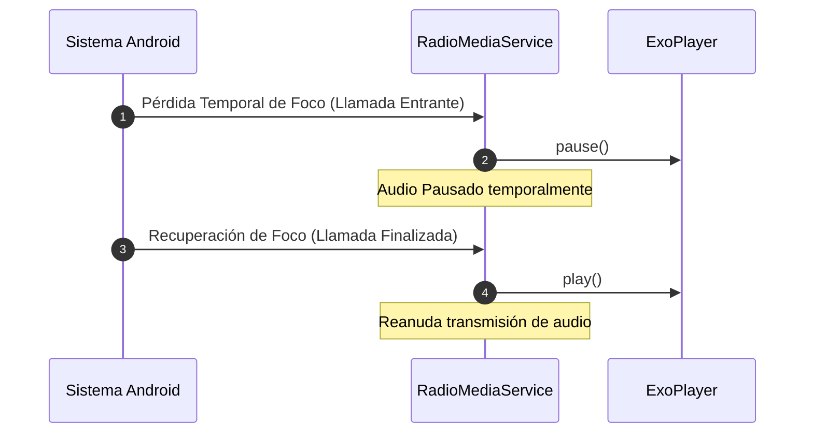
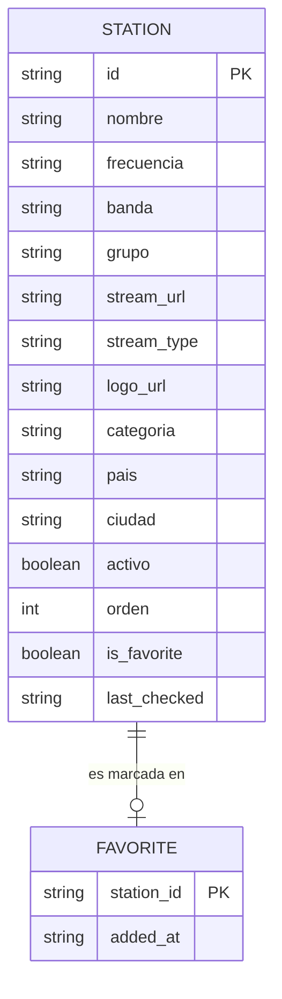

# Arquitectura del Sistema - App Radio CDMX (Preparada Multipaís)

Este documento define la arquitectura técnica, los flujos de datos y la especificación de componentes para la aplicación Android de emisoras de radio de la Ciudad de México.

El sistema utiliza **Firebase Firestore** como CMS en la nube y base de datos remota, una **herramienta CLI en Python** ejecutada localmente para scraping, validación y poblado del catálogo (parametrizada dinámicamente por país y ciudad), y una **App Android nativa (Offline-First)** construida con Jetpack Compose, Room DB y `androidx.media3` (ExoPlayer).

> [!NOTE]
> **Preparación Multipaís en Arquitectura y UI:** Aunque la versión inicial estará focalizada exclusivamente en la Ciudad de México (CDMX), la arquitectura de datos y **la interfaz de usuario (UI en Jetpack Compose)** se diseñan desde el primer día para soportar la incorporación futura de emisoras de otros países o ciudades sin requerir reestructuraciones de código.

---

## 1. Visión General del Sistema (Modelo Firebase + Python CLI + Android)

### 1.1 Diagrama de Bloques General



### 1.2 Flujo del Proceso de Scraping, Validación y Poblado (Python CLI)

El mantenimiento del catálogo lo realiza el desarrollador ejecutando manualmente el script en Python desde su laptop personal, pasando como parámetros el país y la ciudad objetivo.



---

## 2. Arquitectura de la Aplicación Android

La aplicación Android sigue los principios de **Clean Architecture** (UI, Domain, Data, Media).

### 2.1 Diagrama de Capas de la App y Diseño de UI Multipaís



### 2.2 Estrategia de la UI para Soporte Multipaís Futuro
- **Selector Dinámico de Ubicación (`CountryCitySelectorBar`):** La TopAppBar y los filtros superiores integran un componente modular que por defecto selecciona "México / Ciudad de México". Si en el futuro se descargan estaciones de otros países (ej. España / Madrid), el componente activará automáticamente chips de selección rápida o un menú desplegable de países y ciudades sin modificar el diseño general.
- **Tarjetas de Emisoras con Badge de Ubicación:** Cada tarjeta de radio renderiza dinámicamente un badge sutil con la ciudad y el país (o bandera), garantizando claridad visual al coexistir estaciones de distintas regiones.

---

## 3. Flujos de Sincronización (Offline-First)

El consumo de datos garantiza respuesta inmediata en pantalla y actualización reactiva cuando hay conexión a internet:

### 3.1 Carga Inicial de Datos (Lectura Local)



### 3.2 Sincronización Remota desde Firebase Firestore



---

## 4. Flujos del Motor de Audio (`androidx.media3`)

### 4.1 Inicio de Reproducción de Estación



### 4.2 Control de Interrupciones (Audio Focus / Llamadas)



---

## 5. Modelo de Datos

### 5.1 Estructura del Documento Firestore (Colección `stations`)

```json
{
  "id": "cdmx-reactor-1057",
  "nombre": "Reactor 105.7 FM",
  "frecuencia": "105.7 FM",
  "banda": "FM",
  "grupo": "IMER",
  "stream_url": "https://stream.imer.link/reactor1057.mp3",
  "stream_type": "ICECAST",
  "logo_url": "https://firebasestorage.googleapis.com/.../reactor1057.png",
  "categoria": "Rock / Alternativo",
  "pais": "México",
  "ciudad": "Ciudad de México",
  "activo": true,
  "orden": 1,
  "tags": ["rock", "indie", "imer"],
  "last_checked": "2026-08-12T18:00:00Z",
  "status_code": 200,
  "latency_ms": 145
}
```

### 5.2 Modelo Entidad-Relación de Base de Datos Room


