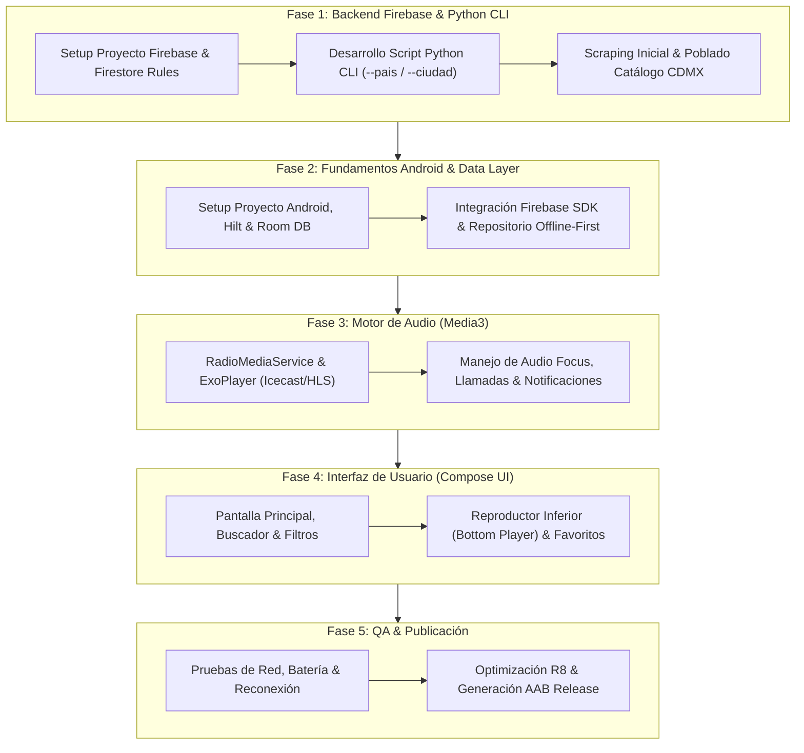

# Plan de Desarrollo - Aplicación Android Radio CDMX (Escalable Multipaís)

Este documento establece la estrategia detallada, el plan de trabajo por fases y las especificaciones técnicas para desarrollar la aplicación Android de radio en vivo.

---

## 1. Resumen y Objetivos

### 1.1 Objetivo Principal y Alcance
- **Enfoque Inicial (MVP):** La aplicación estará especializada e hiper-focalizada de forma inicial en el catálogo de **emisoras de la Ciudad de México (CDMX)**.
- **Visión de Escalabilidad Futura (Multipaís & Multiciudad):** Aunque la versión 1.0 estará centrada exclusivamente en la CDMX, la arquitectura completa (Base de datos Firestore, herramienta CLI de Python y modelo de datos en Android) se diseña de forma nativa para soportar la expansión futura a **otras ciudades de México o de cualquier otro país** sin requerir refactorizaciones en la aplicación ni cambios de estructura en el backend.

### 1.2 Estrategia Técnica
Con base en las especificaciones del proyecto:
- **CMS / Backend Admin:** **Firebase Firestore** (Google Cloud Platform) para la gestión del catálogo global de emisoras en la nube, etiquetadas por `pais` y `ciudad`.
- **Inscriptor / Maintenance Tool:** Script en **Python CLI** ejecutable localmente desde la laptop del desarrollador parametrizado por país y ciudad (`--pais` y `--ciudad`), para realizar scraping, verificar la disponibilidad de streams de audio y sincronizar datos hacia Firestore usando `firebase-admin`.
- **App Android (Cliente):** Aplicación nativa en Kotlin con Jetpack Compose, almacenamiento local en Room DB (estilo Offline-First) y motor de audio en segundo plano mediante `androidx.media3` (ExoPlayer + MediaSessionService).

---

## 2. Pila Tecnológica (Tech Stack)

### 2.1 Aplicación Android
- **Lenguaje:** Kotlin
- **UI Framework:** Jetpack Compose (Material Design 3)
- **Arquitectura UI:** MVVM / Unidirectional Data Flow (UDF)
- **Inyección de Dependencias:** Hilt (Dagger-Hilt)
- **Base de Datos Local:** Room DB (Entidad `Station` con índices por `pais` y `ciudad`)
- **SDK Remoto / CMS:** Firebase Firestore KTX (`com.google.firebase:firebase-firestore-ktx`)
- **Carga de Imágenes:** Coil (Compose integration)
- **Reproducción de Audio:** `androidx.media3:media3-exoplayer` + `androidx.media3:media3-session`
- **Asincronía & Concurrencia:** Kotlin Coroutines + Flow / StateFlow

### 2.2 Herramienta Local de Ingesta & Mantenimiento (Python CLI)
- **Lenguaje:** Python 3.10+
- **CLI Parser:** `argparse` / `click` / `typer` (Parámetros obligatorios: `--pais` / `--country` y `--ciudad` / `--city`)
- **SDK Firebase:** `firebase-admin`
- **Peticiones HTTP & Scraping:** `requests` / `httpx`, `beautifulsoup4`
- **Validación de Datos:** `pydantic`
- **Ejecución:** Manual desde la laptop personal (ej. `python tools/scraper/main.py --pais Mexico --ciudad "Ciudad de Mexico" --sync`)

### 2.3 Backend & Cloud
- **Base de Datos Nube:** Cloud Firestore (Proyecto Firebase)
- **Reglas de Seguridad:** Lectura pública `read: if true;` y escritura restringida a administradores `write: if false;` (gestionada vía credenciales `serviceAccountKey.json`).

---

## 3. Fases de Desarrollo



---

## 4. Detalle de Fases y Tareas

### Fase 1: Configuración de Firebase y Herramienta Python CLI
1. **Crear Proyecto en Firebase Console & Credenciales:**
   - Crear el proyecto `mgradio-app`.
   - Activar Cloud Firestore Database en modo producción.
   - Generar la clave de cuenta de servicio `serviceAccountKey.json` para la herramienta Python.
   - Configurar reglas de seguridad públicas de lectura y restringidas de escritura.

2. **Desarrollo del Script de Ingesta Parametrizado en Python (`mgradio-tools/scraper/`):**
   - **Estructura del Proyecto Python:**
     - `requirements.txt` (`firebase-admin`, `httpx`, `beautifulsoup4`, `pydantic`, `click`).
     - `cli.py` (Mapeo de argumentos `--pais` y `--ciudad`).
     - `scrapers/radio_browser.py` (Módulo para extraer emisoras filtrando dinámicamente por los parámetros recibidos).
     - `verifier.py` (Módulo para realizar pings HTTP `HEAD/GET` a los streams).
     - `firestore_sync.py` (Módulo para realizar `UPSERT` en Firestore asignando `pais` y `ciudad`).
     - `main.py` (Entrypoint principal).

3. **Ejecución Local Inicial (Foco CDMX):**
   - Ejecución para la etapa inicial:
     ```bash
     cd /home/mick/Projects/mgradio-tools/scraper
     python main.py --pais "Mexico" --ciudad "Ciudad de Mexico" --discover --verify-streams --sync-firestore
     ```
   - Validar en Firebase Console que la colección `stations` contenga las emisoras de la CDMX.

### Fase 2: Estructura del Proyecto Android y Capa de Datos
1. **Setup de Proyecto Android:**
   - Vincular `google-services.json` al proyecto Android.
   - Configurar Hilt y Firebase BoM + Firestore.
2. **Capa de Datos (Data Layer):**
   - Configurar Room (`StationEntity` preparada con índices por `pais` y `ciudad` para permitir búsquedas o selectores de ciudad a futuro).
   - Implementar `RemoteDataSource` usando Firebase Firestore SDK (`FirebaseFirestore.getInstance().collection("stations")`).
   - Implementar `StationRepositoryImpl` con estrategia Offline-First (Room DB + Firestore).

### Fase 3: Motor de Audio en Segundo Plano (`Media3`)
1. **Implementar `RadioMediaService`:**
   - Extender `MediaSessionService` con `ExoPlayer` (soporte Icecast/Shoutcast, AAC, MP3, HLS).
2. **Notificación & Audio Focus:**
   - Notificación interactiva en primer plano y manejo automático de llamadas entrantes / audífonos desenganchados.

### Fase 4: Interfaz de Usuario (UI) con Jetpack Compose
1. **Diseño de Pantallas:**
   - **MainScreen:** Catálogo inicial filtrado por CDMX (con diseño limpio para expandir selector de ciudad/país en la AppBar cuando se incorporen más regiones).
   - **CategoryFilter / Search:** Búsqueda rápida por nombre, frecuencia, género o ciudad.
   - **FavoritesTab:** Emisoras favoritas del usuario.
   - **BottomPlayerBar & FullScreenPlayer:** Barra de reproducción persistente.

### Fase 5: Pruebas, Optimización y Empaquetado
1. **Pruebas de Funcionalidad & Release:**
   - Pruebas de estrés de red y generación de AAB para Google Play.

---

## 5. Directrices de Calidad y Estrategia de Expansión Futura

### 5.1 Plan de Expansión (Incorporación de Nuevos Países / Ciudades)
Cuando se decida incorporar emisoras de otros países o ciudades en el futuro, el procedimiento será:
1. Ejecutar el script CLI desde la laptop especificando el nuevo objetivo:
   ```bash
   # Ejemplo futuro: Agregar emisoras de Madrid, España
   python main.py --pais "España" --ciudad "Madrid" --discover --verify-streams --sync-firestore

   # Ejemplo futuro: Agregar emisoras de Guadalajara, México
   python main.py --pais "México" --ciudad "Guadalajara" --discover --verify-streams --sync-firestore
   ```
2. La app en Android sincronizará automáticamente las nuevas emisoras sin necesidad de actualizar la versión de la aplicación en la Play Store, gracias a la estructura flexible de Firestore y Room DB.
